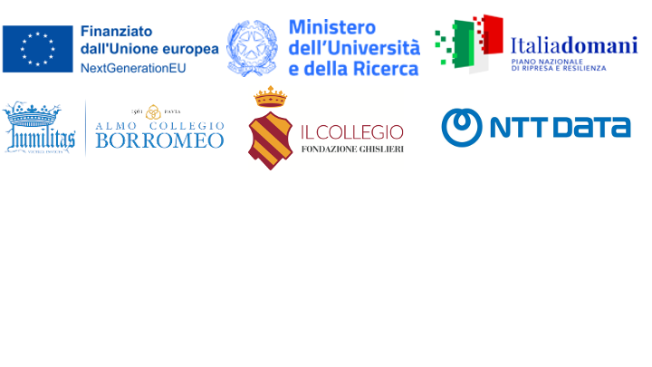

# Global WordNet Conference 2025
## Pavia (Italy), January 27-31, 2025

Welcome to the website of the Global WordNet Conference 2025!

Beside the call for papers and important dates, in this website you will find information about the program and venue of the conference. 

We are looking forward to seeing you in Pavia!

---
## The [call for papers](cfp.md) is out! 

**❗️❗️ New Paper Submission Deadline: October 14, 2024 ❗️❗️**

---

## Scholarships ✈️
There are two travel scholarships of €300 each and two fully funded rooms available at [Collegio Ghislieri](https://www.ghislieri.it/). 

When submitting their paper via EasyChair, authors will be able to apply for one of the two scholarships and fully funded rooms by completing the information in the designated section of the [submission form](https://easychair.org/conferences/?conf=gwc2025). 

The board will decide who to award the scholarships to based on the following criteria: Job position (30 points), Country of origin (30 points), Score given by reviewers to the paper (30 points), Age (10 points).

--- 

## Menu

### [Call for Papers](cfp.md)
### [Important Dates](dates.md)
### [Registration](registration.md)
### [Program](program.md)
### [Organization](organization.md)
### [Venue](venue.md)
### [Travel information](travel.md)
### [Housing possibilities](housing.md)
### [Schlarships](scholarship.md)
### [Contacts](contacts.md)

---

For updates you can also follow our social profiles:
 

**Instagram**: [gwc2025pavia](https://www.instagram.com/gwc2025pavia?igsh=MWZxY21raDJtam96cg==)
 

**X**: [gwc2025pavia](https://x.com/gwc2025pavia)
 

**Telegram**: [Join the channel!](https://t.me/gwc2025pavia)
 

---

