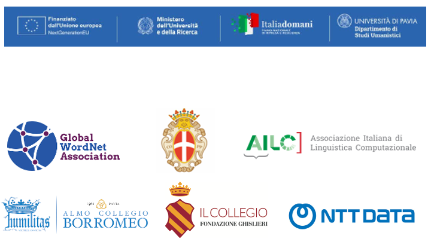

# Global WordNet Conference 2025
## Pavia (Italy), January 27-31, 2025

Welcome to the website of the Global WordNet Conference 2025!

In this website you will find information about the program and venue of the conference. 

We are looking forward to seeing you in Pavia!

---

The 13th International Global Wordnet Conference (GWC2025) will take place in **Pavia (Italy) from 27 to 31 January, 2025**. 

The GWC2025 conference will be held under the auspices of the Global WordNet Association, the Dipartment of Humanities at the University of Pavia, and the Italian Association of Computational Linguistics (AILC), and is supported by Almo Collegio Borromeo, Fondazione Ghislieri, Comune di Pavia - Assessorato Pubblica istruzione e Formazione professionale, and NTT Data.

The conference will feature the participation of three keynote speakers: **Rada Mihalcea** (Unversity of Michigan), **Marco Passarotti** (Università Cattolica del Sacro Cuore Milano), and **Piek Vossen** (Vrije Universiteit Amsterdam).

---

## GWC2025 Wi-Fi 👩🏼‍💻

- Wi-Fi: GLOBALWORDCONF2025
- Password: W0rdgl0bal25!

---

### Pre-conference teach-in by NTT DATA 
📍 [Collegio Borromeo](https://maps.google.com?q=Collegio%20Borromeo,%20Piazza%20del%20Collegio%20Borromeo,%209,%2027100%20Pavia%20PV&ftid=0x47872640a51fd051:0x1f667bf3d67b1269&entry=gps&lucs=,94246480,94242598,94224825,94227247,94227248,47071704,47069508,94218641,94228354,94233079,94203019,47084304,94208458,94208447&g_st=com.google.maps.preview.copy)

**Angela Caiazza (NTT DATA Italia)** - *From Language to Action: How LLMs are Shaping Modern Business Strategies* 

To attend the teach-in, **reservations are needed**. [Register here](https://www.eventbrite.it/e/biglietti-global-wordnet-conference-gwc2025-1116337227699)

--- 
### Join us for the social program of GWC2025! 

The program, which is included in the conference fee, includes two guided tours to Pavia's city center (Wednesday afternoon) and the beautiful [Certosa di Pavia](https://en.wikipedia.org/wiki/Certosa_di_Pavia) (Friday afternoon). You can find all the information and the registration form at [this link](https://form.jotform.com/250073124594352). 

The deadline to sign up is **Wednesday, January 15**.

---

## Menu

### [Call for Papers](cfp.md)
### [Important Dates](dates.md)
### [Registration](registration.md)
### [Program](program.md)
### [Posters](posters.md)
### [Keynote speakers](keynote.md)
### [Organization](organization.md)
### [Venue](venue.md)
### [Travel information](travel.md)
### [Housing possibilities](housing.md)
### [Scholarships](scholarship.md)
### [Contacts](contacts.md)

---

For updates you can also follow our social profiles:
 

**Instagram**: [gwc2025pavia](https://www.instagram.com/gwc2025pavia?igsh=MWZxY21raDJtam96cg==)
 

**X**: [gwc2025pavia](https://x.com/gwc2025pavia)
 

**Telegram**: [Join the channel!](https://t.me/gwc2025pavia)
 

---

 

This project is funded through the European Union Funding Program – NextGenerationEU – Missione 4 Istruzione e ricerca - componente 2, investimento 1.1” Fondo per il Programma Nazionale della Ricerca (PNR) e Progetti di Ricerca di Rilevante Interesse Nazionale (PRIN)” progetto PRIN_2022 2022YAPFNJ "Linked WordNet for Indo-European Languages" CUP F53D2300490 0001 - Dipartimento Studi Umanistici (Università di Pavia)

