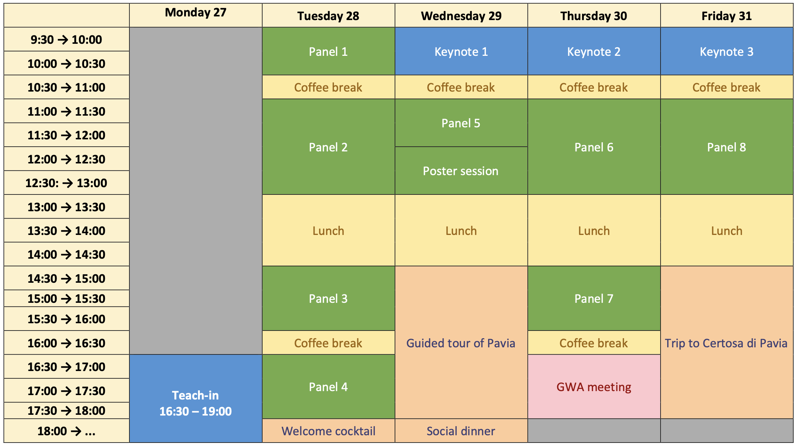

# Program 📆

## Schedule

## Program in detail

### MONDAY 27

- **15.00-16.00: Registration** (📍 Aula Volta, [Palazzo Centrale](https://maps.app.goo.gl/uDcBzWps2nrdF3qP8?g_st=com.google.maps.preview.copy) - Main University Building)

- **16.30-19.00: Teach-in by Angela Caiazza (NTT DATA Italia)** - *From Language to Action: How LLMs are Shaping Modern Business Strategies* (📍 [Collegio Borromeo](https://maps.google.com?q=Collegio%20Borromeo,%20Piazza%20del%20Collegio%20Borromeo,%209,%2027100%20Pavia%20PV&ftid=0x47872640a51fd051:0x1f667bf3d67b1269&entry=gps&lucs=,94246480,94242598,94224825,94227247,94227248,47071704,47069508,94218641,94228354,94233079,94203019,47084304,94208458,94208447&g_st=com.google.maps.preview.copy))

To attend the teach-in, **reservations are needed**. [Register here](https://www.eventbrite.it/e/biglietti-global-wordnet-conference-gwc2025-1116337227699)

### TUESDAY 28 
📍 Aula Volta, [Palazzo Centrale](https://maps.app.goo.gl/uDcBzWps2nrdF3qP8?g_st=com.google.maps.preview.copy) - Main University Building

- **8.30-9.20: Registration** 
- **9.20-9.40: Opening**
- **9.40-10.30 Session 1** - Chair: *Claudia Roberta Combei*
  - 9.40-10.10: **Ivelina Stoyanova and Svetlozara Leseva** - [*Illustrating the Usage of Verbs in WordNet: the Class of Self-motion Verbs*](https://github.com/unipv-larl/GWC2025/releases/download/papers/GWC2025_paper_22.pdf)
  - 10.10-10.30: **Flavio Pisciotta, Ludovica Pannitto, Lucia Busso, Beatrice Bernasconi and Francesca Masini** - [*Constraining constructions with WordNet: pros and cons for the semantic annotation of fillers in the Italian Constructicon*](https://github.com/unipv-larl/GWC2025/releases/download/papers/GWC2025_paper_33.pdf)

- **10.30-11.00: ☕️ Coffee break**

- **11.00-13.00: Session 2** - Chair: *Fahad Khan*
  - 11.00-11.30: **John P. McCrae** - [*Renovating the Verb Hierarchy of English Wordnet*](https://github.com/unipv-larl/GWC2025/releases/download/papers/GWC2025_paper_1.pdf) 
  - 11.30-12.00: **Krasimir Angelov** - [*An Abstract Multilingual WordNet*](https://github.com/unipv-larl/GWC2025/releases/download/papers/GWC2025_paper_2.pdf) 
  - 12.00-12.30: **Zhihan Cao, Hiroaki Yamada, Simone Teufel and Takenobu Tokunaga** - [*Misalignment of Semantic Relation Knowledge between WordNet and Human Intuition*](https://github.com/unipv-larl/GWC2025/releases/download/papers/GWC2025_paper_5.pdf)
  - 12.30-13.00: **Ivelina Stoyanova, Verginica Barbu Mititelu, Svetlozara Leseva and Gianina Iordachioaia** - [*Expanding and Enhancing Derivational and Morphosemantic Relations in Princeton WordNet*](https://github.com/unipv-larl/GWC2025/releases/download/papers/GWC2025_paper_13.pdf)

- **13.00-14.30: 🍱 Lunch break**

- **14.30-15.30: Session 3** - Chair: *Svetlozara Leseva*
  - 14.30-15.00: **Giovanni Puccetti, Andrea Esuli and Marianna Bolognesi** - [*Wordnet and Word Ladders: Climbing the abstraction taxonomy with LLMs*](https://github.com/unipv-larl/GWC2025/releases/download/papers/GWC2025_paper_18.pdf)
  - 15.00-15.30: **Ágoston Tóth and Esra Abdelzaher** - [*Improving the lexicographic accessibility of WN through LLMs*](https://github.com/unipv-larl/GWC2025/releases/download/papers/GWC2025_paper_20.pdf)

- **15.30-16.00: ☕️ Coffee break**

- **16.00-17.00: Session 4** - Chair: *Erica Biagetti*
  - 16.00-16.30: **Simona Corciulo, Rossana Damiano, Viviana Patti and Mario Alessandro Bochicchio** - [*The Impact of Age and Gender on Sensory Imagery: Insights from the IMAVIC Dataset*](https://github.com/unipv-larl/GWC2025/releases/download/papers/GWC2025_paper_16.pdf)
  - 16.30-17.00: **John P. McCrae, Haotian Zhu, Fei Xia, Al Waskow and Kexin Gao** - [*Remedying Gender Bias in Open English Wordnet*](https://github.com/unipv-larl/GWC2025/releases/download/papers/GWC2025_paper_17.pdf)

- **18.00:🍸 Welcome cocktail**	(📍 [Palazzo Mezzabarba](https://maps.app.goo.gl/2EHCAgLPzhbU89fn6?g_st=com.google.maps.preview.copy), Pavia City Hall)

### WEDNESDAY 29
📍 Aula Volta, [Palazzo Centrale](https://maps.app.goo.gl/uDcBzWps2nrdF3qP8?g_st=com.google.maps.preview.copy) - Main University Building

Chair: *German Rigau*
- **9.30-10.30: Keynote Speaker**: **Piek Vossen** - *30 years embracing and abandoning wordnets* 

- **10.30-11.00: ☕️ Coffee break**	

- **11.00-11.50: Session 5** - Chair: *Luca Brigada Villa*
  - 11.00:11.30: **Yicheng Sun and Jie Wang** - *AI-WordNet for Controllable Construction of Cloze Questions*
  - 11.30-11.50: **Fahad Khan and John P. McCrae** - [*SHACL4GW: SHACL Shapes for the Global Wordnet Association RDF Schema*](https://github.com/unipv-larl/GWC2025/releases/download/papers/GWC2025_paper_9.pdf)

- **11.50-13.00: 📰 Poster session**
📍 Aula Scarpa, [Palazzo Centrale](https://maps.app.goo.gl/uDcBzWps2nrdF3qP8?g_st=com.google.maps.preview.copy) - Main University Building
  - **Joanna Ut-Seong Sio, Luis Morgado Da Costa, Francis Bond and Kamila Liedermannova** - [_Can you hear me now? Towards talking Wordnets: A Cantonese Case Study_](https://github.com/unipv-larl/GWC2025/releases/download/papers/GWC2025_paper_37.pdf)
  - **Ivan Lacić and Ludovica Pannitto** - [_Deriving semantic classes of Italian adjectives via word embeddings: a large-scale investigation_](https://github.com/unipv-larl/GWC2025/releases/download/papers/GWC2025_paper_12.pdf)
  - **Eleonora Ghizzota, Pierpaolo Basile, Claudia D'Amato and Nicola Fanizzi** - [_Enhancing Linguistic Resources for Diachronic Analysis via Linked Data_](https://github.com/unipv-larl/GWC2025/releases/download/papers/GWC2025_paper_14.pdf)
  - **Alžběta Kučerová and Johann-Mattis List** - [_Everybody Likes to Sleep: A Computer-Assisted Comparison of Object Naming Data from 30 Languages_](https://github.com/unipv-larl/GWC2025/releases/download/papers/GWC2025_paper_24.pdf)
  - **Ikkyu Nishimura, Yohei Murakami and Mondheera Pituxcoosuvarn** - [_Extracting Conceptual Differences between Translation Pairs using Multilingual-WordNet_](https://github.com/unipv-larl/GWC2025/releases/download/papers/GWC2025_paper_7.pdf)
  - **Elīza Gulbe, Agute Klints, Gunta Nešpore-Bērzkalne, Laura Rituma, Madara Stāde, Ilze Lokmane and Pēteris Paikens** - [_Extracting WordNet links from dictionary glosses - Latvian Wordnet example_](https://github.com/unipv-larl/GWC2025/releases/download/papers/GWC2025_paper_19.pdf)
  - **Esra Abdelzaher and Bacem Essam** - _Kinship Terms: Intercultural Linguistic Markers of Teknonymy_
  - **Johann Bergh, Jörg Waitelonis and Melanie Siegel** - [_Leveraging LLMs for Constructing WordNets Automatically as Bilingual Resources_](https://github.com/unipv-larl/GWC2025/releases/download/papers/GWC2025_paper_15.pdf)
  - **Shikhar Kr. Sarma, Kuwali Talukdar, Kishore Kashyap, Ratul Deka and Bhatima Baro** - _Wordnet Enhanced Neural Machine Translation for Assamese-Bodo Low Resource Language Pair_ 

- **13.00-14.30: 🍱 Lunch break**
		
**14.30: Guided tour of Pavia**	

**20.00: Social dinner** (📍 [Restaurant "Civico Uno"](https://maps.app.goo.gl/PEaoNd3kXLWmhdAQ6?g_st=com.google.maps.preview.copy))

### THURSDAY 30
📍 Aula Volta, [Palazzo Centrale](https://maps.app.goo.gl/uDcBzWps2nrdF3qP8?g_st=com.google.maps.preview.copy) - Main University Building

Chair: *Francis Bond*
- **9.30-10.30**: **Keynote Speaker**: **Rada Mihalcea** - *Towards a Cultural WordNet: From Words to Meanings to Cross-Cultural Nuances*

- **10.30-11.00: ☕️ Coffee break**	

- **11.00-13.00: Session 6** - Chair: *Marco Passarotti*
  - 11.00-11.20: **Fahad Khan, Daniel Prado Aranda, Francesca Romana Cammisa, Michele Cavallaro, Maria Francesca Carmela Giusy Germanà, Federica Misino, Chiara Tenti, Javier E. Díaz-Vera, Francisco Javier Minaya Gómez and Francesca Frontini** - [*Some Updates on the Development of an Historical Language Wordnet*](https://github.com/unipv-larl/GWC2025/releases/download/papers/GWC2025_paper_8.pdf)
  - 11.20-11.40: **Giorgio Carboni, Riccardo Ginevra and Litta Modignani Picozzi Eleonora Maria Gabriella** - [*Using digital resources to study semantics and word formation in a historical language:  FEAR and TREMOR in the Latin WordNet and Word Formation Latin*](https://github.com/unipv-larl/GWC2025/releases/download/papers/GWC2025_paper_40.pdf)
  - 11.40-12.10: **Daniela Santoro, Beatrice Marchesi, Silvia Zampetta, Marco Del Tredici, Erica Biagetti, Eleonora Litta, Claudia Roberta Combei, Stefano Rocchi, Tullio Facchinetti, Riccardo Ginevra and Chiara Zanchi** - [*Exploring Latin WordNet synset annotation with LLMs*](https://github.com/unipv-larl/GWC2025/releases/download/papers/GWC2025_paper_32.pdf)
  - 12.10-12.30: **So Miyagawa, Luis Morgado da Costa, Laura Slaughter and Heike Behlmer** - [*Automatic Detection of Coptic Text Reuse: Applying Coptic Wordnet to Intertextuality Studies in Selected Coptic Monastic Writings*](https://github.com/unipv-larl/GWC2025/releases/download/papers/GWC2025_paper_29.pdf)
  - 12.30-13.00: **Gianluca Scatigno** - [*Analysis of Anachronistic Lemmas and Semantic Fields in Ancient Greek WordNet*](https://github.com/unipv-larl/GWC2025/releases/download/papers/GWC2025_paper_3.pdf)

- **13.00-14.30: 🍱 Lunch break**
				
- **14.30-16.00: Session 7** - Chair: *Tullio Facchinetti*
  - 14.30-15.00: **Francis Bond and Rowan Hall Maudslay** - [*Metonymy is more multilingual than metaphor: Analysing tropes using ChainNet and the Open Multilingual Wordnet*](https://github.com/unipv-larl/GWC2025/releases/download/papers/GWC2025_paper_36.pdf)
  - 15.00-15.30: **Ewa Rudnicka, Bartłomiej Alberski and Maciej Piasecki** - [*plWordNet 5.0 -- challenges of a life-long wordnet development process*](https://github.com/unipv-larl/GWC2025/releases/download/papers/GWC2025_paper_26.pdf)
  - 15.30-16.00: **Nikolay Paev, Kiril Simov and Petya Osenova** - [*Word Sense Disambiguation with Large Language Models: Casing Bulgarian*](https://github.com/unipv-larl/GWC2025/releases/download/papers/GWC2025_paper_27.pdf)

- **16.00-16.30: ☕️ Coffee break**

- **16.30: GWA Meeting**	

### FRIDAY 31
📍 [Collegio Ghislieri](https://maps.app.goo.gl/9mVLgXbCFfK5Q52S6?g_st=com.google.maps.preview.copy), Aula Goldoniana

Chair: *Chiara Zanchi*
- **9.30-10.30**: **Keynote Speaker**: **Marco Passarotti** - *WordNet in the Net. Making It All Interact*

- **10.30-11.00: ☕️ Coffee break**	

- **11.00-13.00: Session 8** - Chair: *John McCrae*
  - 11.00-11.30: **Ahti Lohk and Heili Orav** - [*An Experiment in CILI-Based Validation: The Case of the Estonian Wordnet*](https://github.com/unipv-larl/GWC2025/releases/download/papers/GWC2025_paper_21.pdf)
  - 11.30-11.50: **Francis Bond** - [*Adding Audio to Wordnets*](https://github.com/unipv-larl/GWC2025/releases/download/papers/GWC2025_paper_38.pdf)
  - 11.50-12.20: **Neslihan Cesur, Sabri İnce, Ali Hakkı Aydın, Ece Su Eren, Deniz Gücükçavuş, Murat Papaker, Kaan Bayar, Deniz Baran Aslan, Yelda Fırat and Olcay Taner Yıldız** - [*A Semi-Automated Approach to the Annotation of Argument Structures in Turkish Datasets*](https://github.com/unipv-larl/GWC2025/releases/download/papers/GWC2025_paper_30.pdf)
  - 12.20-12.40: **Lucia Galiero, Federico Boschetti, Riccardo Del Gratta, Angelo Mario Del Grosso and Monica Monachini** - [*Enhancing Lexical Resources: Synset Expansion and Cross-Linking Between ItalWordNet and MariTerm*](https://github.com/unipv-larl/GWC2025/releases/download/papers/GWC2025_paper_11.pdf)
  - 12.40-13.00: **Shikhar Kr. Sarma, Ratul Deka, Bhatima Baro, Vaskar Deka, Umesh Deka, Mirzanur Rahman and Sarmah Satyajit** - *Challenges and Solutions in Developing Low-Resource Wordnets: Insights from Assamese and Bodo*

- **13.00-14.30: 🍱 Lunch break**	
		
- **14.30: Trip to Certosa di Pavia**
