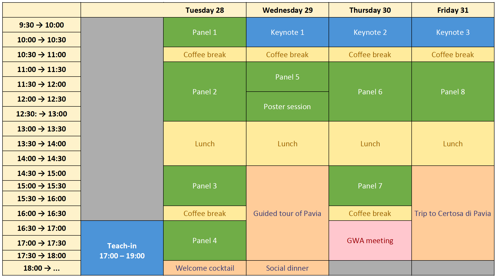

# Program 📆

## Schedule

## Program in detail

### MONDAY 27

- **15:00-16:00: Registration** (📍 Aula Volta, Palazzo Centrale)

- **16:30-19:00: Teach-in by NTT DATA** - *From Language to Action: How LLMs are Shaping Modern Business Strategies* (📍 Collegio Borromeo)

### TUESDAY 28 
📍 Aula Volta, Palazzo Centrale

- **8:30-9:20: Registration** 
- **9:20-9:40: Opening**
- **9:40-10:30 Session 1**
  - 9:40-10:10: **Ivelina Stoyanova and Svetlozara Leseva** - *Illustrating the Usage of Verbs in WordNet: the Class of Self-motion Verbs*
  - 10:10-10:30: **Flavio Pisciotta, Ludovica Pannitto, Lucia Busso, Francesca Masini and Beatrice Bernasconi** - *Constraining constructions with WordNet: pros and cons for the semantic annotation of fillers in the Italian Constructicon*

- **10:30-11:00: ☕️ Coffee break**

- **11:00-13:00: Session 2**
  - 11:00-11:30: **John P. McCrae** - *Renovating the Verb Hierarchy of English Wordnet*
  - 11:30-12:00: **Krasimir Angelov** - *An Abstract Multilingual WordNet* 
  - 12:00-12:30: **Zhihan Cao, Hiroaki Yamada, Simone Teufel and Takenobu Tokunaga** - *Misalignment of Semantic Relation Knowledge between WordNet and Human Intuition*
  - 12:30-13:00: **Ivelina Stoyanova, Verginica Barbu Mititelu, Svetlozara Leseva and Gianina Iordachioaia** - *Expanding and Enhancing Derivational and Morphosemantic Relations in Princeton WordNet*

- **13:00-14:30: 🍱 Lunch break**

- **14:30-15:30: Session 3**
  - 14:30-15:00: **Giovanni Puccetti, Andrea Esuli and Marianna Bolognesi** - *Wordnet and Word Ladders: Climbing the abstraction taxonomy with LLMs*
  - 15:00-15:30: **Ágoston Tóth and Esra Abdelzaher** - *Improving the lexicographic accessibility of WN through LLMs*

- **15:30-16:00: ☕️ Coffee break**

- **16:00-17:00: Session 4**
  - 16:00-16:30: **Simona Corciulo, Rossana Damiano, Viviana Patti and Mario Alessandro Bochicchio** - *The Impact of Age and Gender on Sensory Imagination: Insights from the Contextualized Sensory (CSy) Dataset*
  - 16:30-17:00: **John P. McCrae, Haotian Zhu, Fei Xia, Al Waskow and Kexin Gao** - *Remedying Gender Bias in Open English Wordnet*

- **18:00:🍸 Welcome cocktail**	(📍 Palazzo Mezzabarba, Pavia City Hall)

### WEDNESDAY 29
📍 Aula Volta, Palazzo Centrale

- **9:30-10:30: Keynote Speaker**: **Piek Vossen** - *30 years embracing and abandoning wordnets* 

- **10:30-11:00: ☕️ Coffee break**	

- **11:00-11:50: Session 5**
  - 11:00:11:30: **Yicheng Sun and Jie Wang** - *AI-WordNet for Controllable Construction of Cloze Questions*
  - 11:30-11:50: **Fahad Khan and John P. McCrae** - *SHACL4GW: SHACL Shapes for the Global Wordnet Association RDF Schema*

- **11:50-13:00: 📰 Poster session**

- **13:00-14:30: 🍱 Lunch break**
		
**Afternoon: Guided tour of Pavia**	

**Evening: Social dinner** (📍 Restaurant "Civico Uno")

### THURSDAY 30
📍 Aula Volta, Palazzo Centrale

- **9:30-10:30**: **Keynote Speaker**: **Rada Mihalcea** - *tba*

- **10:30-11:00: ☕️ Coffee break**	

- **11:00-13:00: Session 6**
  - 11:00-11:20: **Fahad Khan, Daniel Prado Aranda, Francesca Romana Cammisa, Michele Cavallaro, Maria Francesca Carmela Giusy Germanà, Federica Misino, Chiara Tenti, Javier E. Díaz-Vera, Francisco Javier Minaya Gómez and Francesca Frontini** - *Some Updates on the Development of an Historical Language Wordnet*
  - 11:20-11:40: **Giorgio Carboni, Riccardo Ginevra and Litta Modignani Picozzi Eleonora Maria Gabriella** - *Using digital resources to study semantics and word formation in a historical language:  FEAR and TREMOR in the Latin WordNet and Word Formation Latin*
  - 11:40-12:10: **Daniela Santoro, Beatrice Marchesi, Silvia Zampetta, Marco Del Tredici, Erica Biagetti, Eleonora Litta, Claudia Roberta Combei, Stefano Rocchi, Tullio Facchinetti, Riccardo Ginevra and Chiara Zanchi** - *Exploring Latin WordNet synset annotation with LLMs*
  - 12:10-12:30: **So Miyagawa, Luis Morgado da Costa, Laura Slaughter and Heike Behlmer** - *Automatic Detection of Coptic Text Reuse: Applying Coptic Wordnet to Intertextuality Studies in Selected Coptic Monastic Writings*
  - 12:30-13:00: **Gianluca Scatigno** - *Analysis of Anachronistic Lemmas and Semantic Fields in Ancient Greek WordNet*

- **13:00-14:30: 🍱 Lunch break**
				
- **14:30-16:00: Session 7**
  - 14:30-15:00: **Francis Bond and Rowan Hall Maudslay** - *Metonymy is more multilingual than metaphor: Analysing tropes using ChainNet and the Open Multilingual Wordnet*
  - 15:00-15:30: **Ewa Rudnicka, Bartłomiej Alberski and Maciej Piasecki** - *plWordNet 5.0 -- challenges of a life-long wordnet development process*
  - 15:30-16:00: **Nikolay Paev, Kiril Simov and Petya Osenova** - *Word Sense Disambiguation with Large Language Models: Casing Bulgarian* 

- **16:00-16:30: ☕️ Coffee break**

- **16:30: GWA Meeting**	

### FRIDAY 31
📍 Collegio Ghislieri, Aula Goldoniana

- **9:30**: **Keynote Speaker**: **Marco Passarotti** - *WordNet in the Net. Making It All Interact*

- **10:30-11:00: ☕️ Coffee break**	

- **11:00-13:00: Session 8**
  - 11:00-11:30: **Ahti Lohk and Heili Orav** - *An Experiment in CILI-Based Validation: The Case of the Estonian Wordnet*
  - 11:30-11:50: **Francis Bond** - *Adding Audio to Wordnets*
  - 11:50-12:20: **Neslihan Cesur, Sabri İnce, Ali Hakkı Aydın, Ece Su Eren, Deniz Gücükçavuş, Murat Papaker, Kaan Bayar, Deniz Baran Aslan, Yelda Fırat and Olcay Taner Yıldız** - *A Semi-Automated Approach to the Annotation of Argument Structures in Turkish Datasets*
  - 12:20-12:40: **Lucia Galiero, Federico Boschetti, Riccardo Del Gratta, Angelo Mario Del Grosso and Monica Monachini** - *Enhancing Lexical Resources: Synset Expansion and Cross-Linking Between ItalWordNet and MariTerm*
  - 12:40-13:00: **Shikhar Kr. Sarma, Ratul Deka, Bhatima Baro, Vaskar Deka, Umesh Deka, Mirzanur Rahman and Sarmah Satyajit** - *Challenges and Solutions in Developing Low-Resource Wordnets: Insights from Assamese and Bodo*

- **13:00-14:30: 🍱 Lunch break**	
		
- **Afternoon: Trip to Certosa di Pavia**
