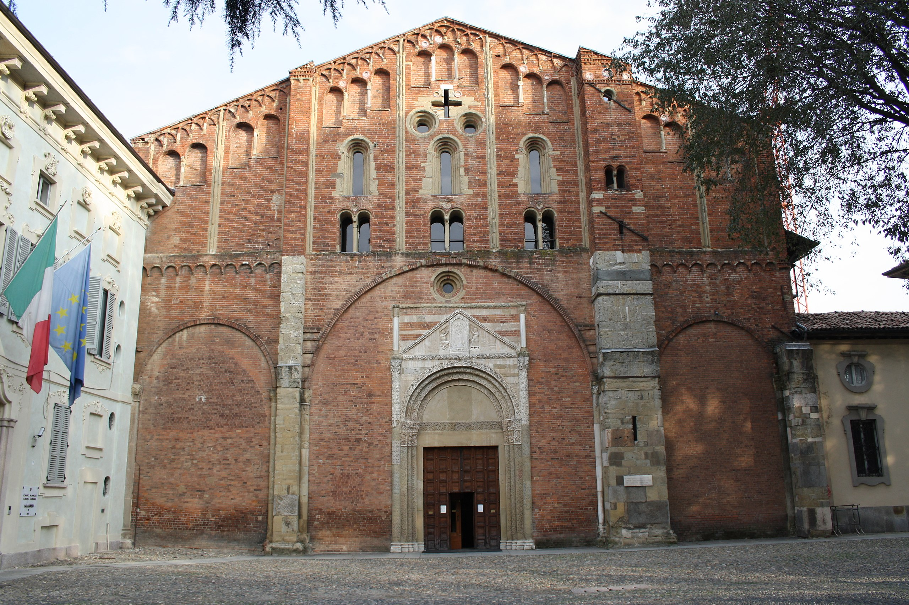
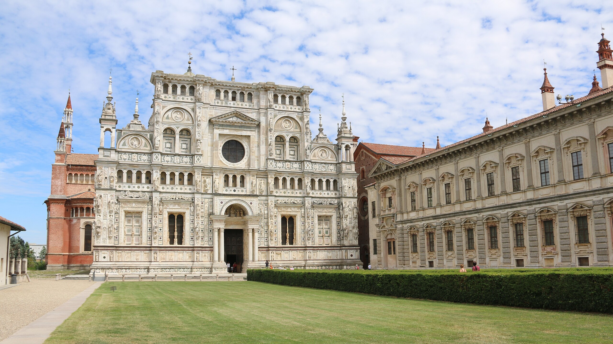

# VENUE📍

The conference will be held at the Department of Humanities, University of Pavia. 

The Department of Humanities is located in the city center. There are two main buildings, Palazzo Centrale (Figure 1) and Palazzo San Tommaso (Figure 2), which are a five minute walk from each other (Figure 3). 

**Figure 1 - Palazzo Centrale**

 

**Figure 2 - Palazzo San Tommaso**

 

**Figure 3 - Distance between Palazzo Centrale and Palazzo San Tommaso**

 

These buildings house numerous lecture halls, ranging from smaller ones to larger, including historical halls like Aula Scarpa (Figure 4) or Aula Volta (Figure 5)

**Figure 4 - Aula Scarpa**

 

**Figure 5 - Aula Volta**

 

Pavia (Figure 6) is a small, attractive university town, with several university colleges, a vibrant student life, and several historical landmarks, including the Romanesque churches of San Michele Maggiore (Figure 7) and San Pietro in Ciel d’Oro. Over the centuries, the former hosted many sumptuous ceremonies and coronations, including the coronation Frederick Barbarossa (1155), while the latter houses the tombs of Augustine of Hippo, Boethius, and Liutprand, King of the Lombards. The University, officially established in 1361, is among the oldest ones in Europe.

**Figure 6 - Pavia from above**

 

**Figure 7 - Basilica di San Michele Maggiore**

**Figure 8 - Basilica di San Pietro in Ciel D'Oro**

Just a 10-minute train ride away is the famous Certosa di Pavia (Figure 9), a monastery built in 1396–1495 and still one of the largest monasteries in Italy. 

**Figure 9 - Certosa di Pavia**

 
 
 

---
🏠 [Home](https://unipv-larl.github.io/GWC2025/)
